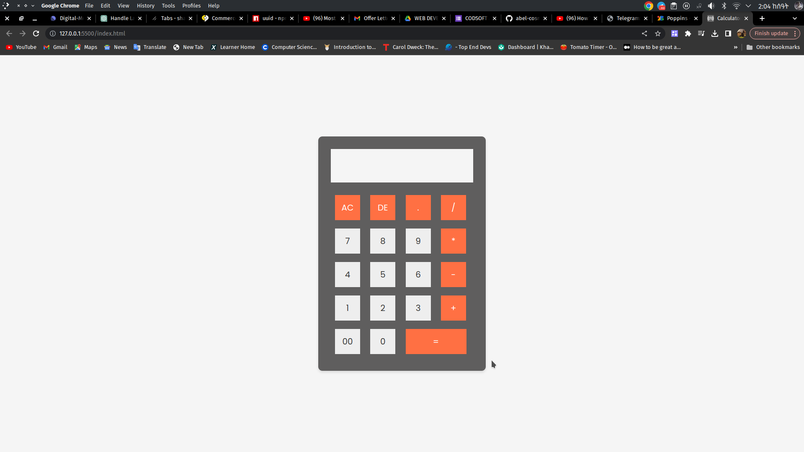

# Simple Calculator

This is a simple calculator web application built with HTML, CSS, and JavaScript. It provides basic arithmetic operations such as addition, subtraction, multiplication, and division.

## Features

- Responsive design that adapts to different screen sizes, including mobile devices.
- Stylish user interface with buttons for digits, operators, and clearing the display.
- Real-time calculation and display of results.
- Error handling for invalid expressions.

## Demo

You can try out the calculator by visiting the live demo [here](#).

## Screenshots



## Usage

1. Clone the repository to your local machine:

   ```
   git clone https://github.com/yourusername/calculator.git
   ```

2. Open the `index.html` file in your web browser to use the calculator.

## How it Works

The calculator functions by parsing and evaluating mathematical expressions in real-time. It includes the following features:

- AC button: Clears the display.
- DE button: Deletes the last character from the display.
- Digits (0-9): Append digits to the display.
- Operators (+, -, \*, /): Append operators to the display.
- Equal (=) button: Calculates the result of the expression.

## Customization

You can customize the calculator's appearance and behavior by modifying the CSS and JavaScript files in the `styles` and `js` directories, respectively.

## License

This project is licensed under the MIT License - see the [LICENSE](LICENSE) file for details.

## Acknowledgments

- This calculator was created as a coding exercise by Abel Shibabaw.

---